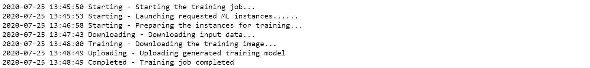
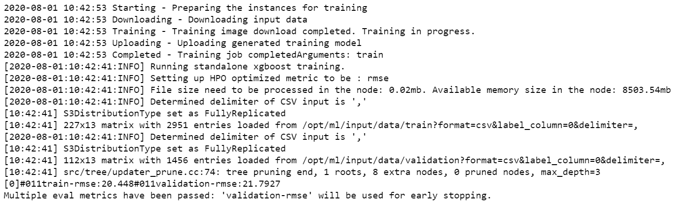
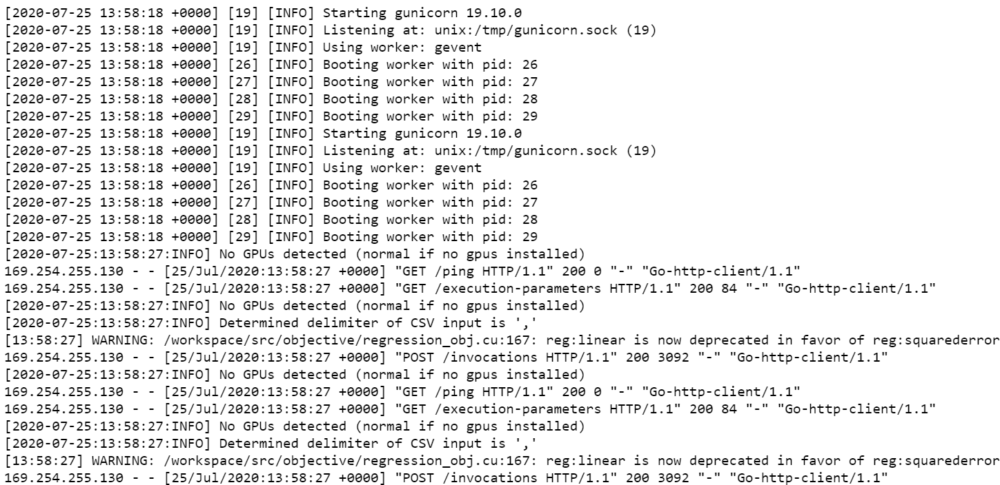
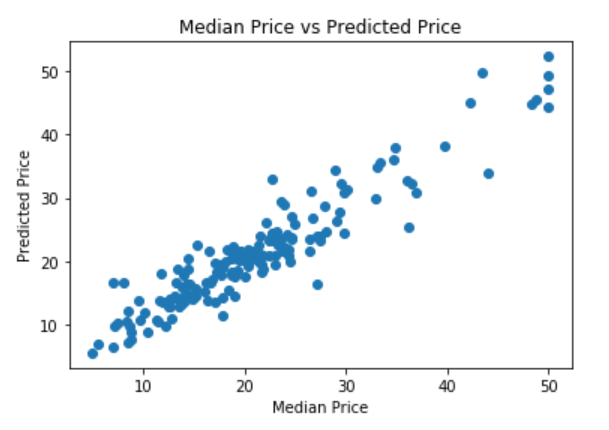

# AWS-Sagemaker-Boston-Housing

Simple ML project created from scratch in AWS Sagemaker.

The focus of the project is to show all of the needed steps to load, train, optimize and deploy the model in AWS. (Not on getting the best model)

The project will cosist of three note Jupyter notebooks:

1. Boston Housing - XGBoost (Batch Transform) - High Level.ipynb

2. Boston Housing - XGBoost (Hyperparameter Tuning) - High Level.ipynb

3. Boston Housing - XGBoost (Deploy) - High Level

## AWS Model Training

## AWS Tuned Model Training

## Batch Transformation

## Model Evaluation

